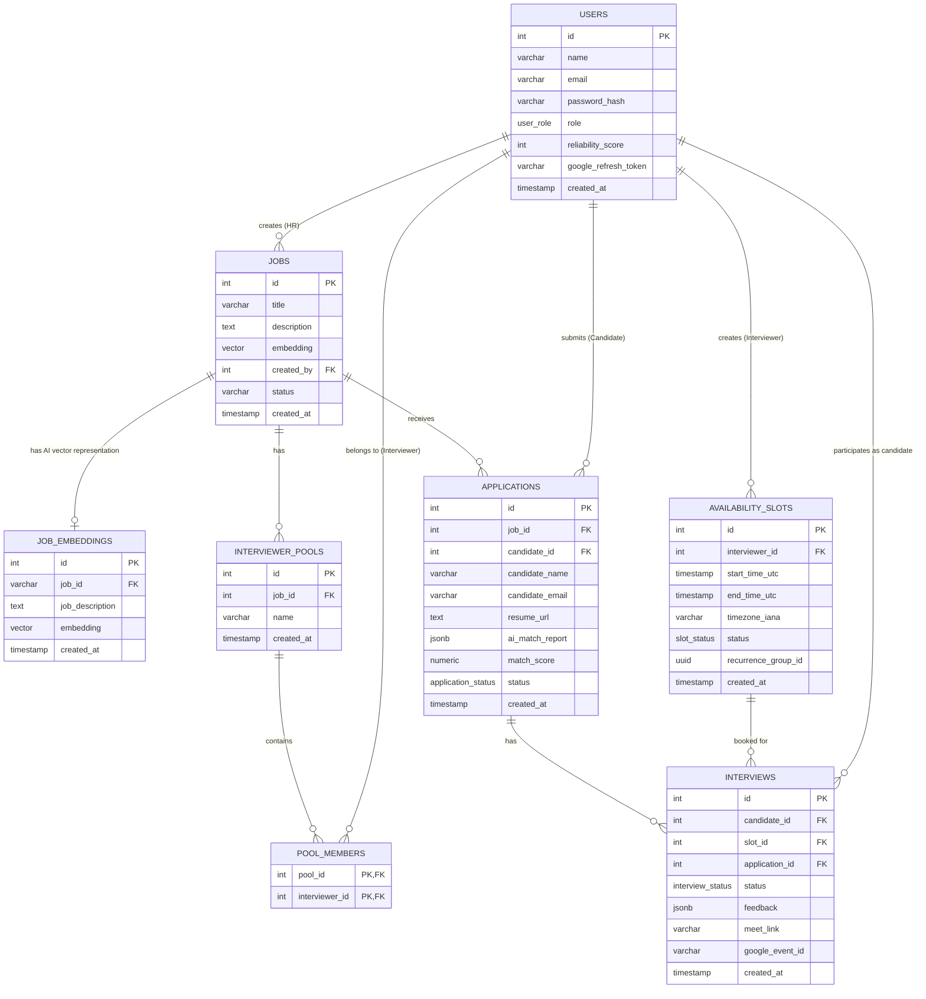
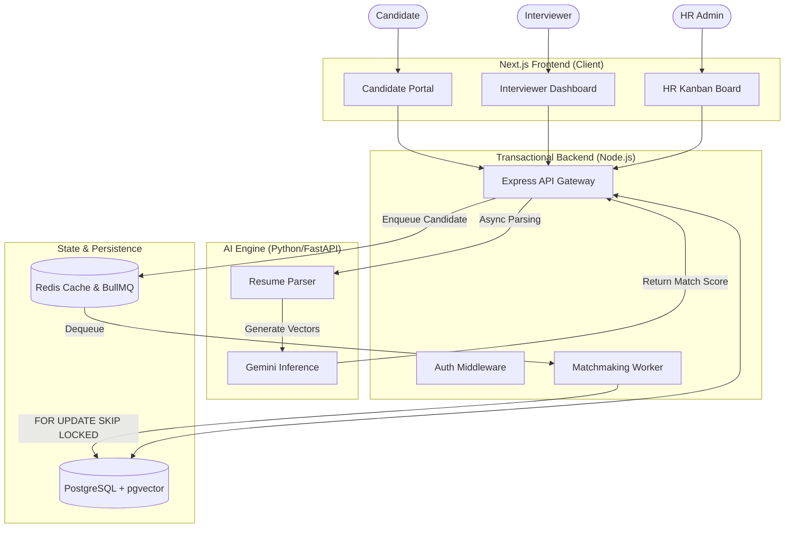

# HireLattice

**Intelligent End-to-End Interview Pipeline System**

> **Status:** Currently under active development.

HireLattice is an automated hiring workflow system that manages 
the full lifecycle of the interview process — from job posting 
to candidate ranking to interview scheduling to post-interview 
feedback. 

The CORE feature and differentiator is the intelligent 
scheduling engine. Everything else supports it.

THE PROBLEM IT SOLVES

Real hiring workflows are broken in three ways:
1. Resume screening is manual and slow
2. Interview scheduling is done over email chains, 
   inefficient and error-prone
3. When interviewers cancel, the whole process restarts 
   manually
By offloading the manual overhead of scheduling back-and-forths and initial resume vetting, HireLattice empowers HR administrators and interviewers to focus purely on evaluating talent.

---

## Key Features

### AI-Powered Resume Intelligence
HireLattice goes beyond rigid ATS keyword matching. Using semantic vector embeddings, the system genuinely "understands" a candidate's resume context. It automatically generates a comprehensive Match Report comparing the applicant's experience against the Job Description, surfacing an explainable Fit Score alongside matched and missing skills.

**Transparent, Constructive Rejections:** HireLattice solves a major pain point in the hiring industry—the silent rejection. When a candidate's AI Match Score falls below the required threshold, they aren't just ghosted. The system automatically sends a personalized rejection email containing the specific, constructive reasoning generated by the AI. This provides candidates with complete transparency into exactly why their profile wasn't a fit.

### Zero-Collision Autonomous Scheduling Engine
**At a basic level:** When a candidate applies and their AI match score passes the required criteria, the system autonomously finds an available interviewer and schedules the interview—zero human intervention required. 

The core of the platform is an event-driven Matchmaking Engine designed to solve the notorious "double-booking" and concurrency issues found in distributed scheduling systems. Key architectural decisions include:
- **Advanced Concurrency Control:** Implements robust row-level database locking within the matching worker to ensure multiple background queues never attempt to double-book the same availability slot simultaneously.
- **Ephemeral Reservations:** Utilizes high-speed, time-to-live caching (Redis) to temporarily reserve an interviewer's slot while waiting for candidate confirmation, automatically returning the slot to the pool if the candidate times out.
- **Physical Overlap Prevention:** Enforces strict geometric time-range constraints at the database level to mathematically guarantee that overlapping calendar slots can never exist, acting as an impenetrable fail-safe against application-layer race conditions.
- **Timezone Resilience:** Normalizes all scheduling operations against exact IANA timezone strings rather than basic UTC offsets, gracefully handling complex global edge cases like Daylight Saving Time transitions.

### Human-in-the-Loop Evaluation
AI assists, but humans decide. Following an interview, team members submit structured, qualitative feedback. HR administrators are then presented with a unified dashboard that contrasts the AI's initial technical assessment with the human interviewer's notes, providing a holistic 360-degree view for the final hiring decision.

### Role-Based Portals & Heuristics
HireLattice features three distinctly decoupled dashboards:
- **HR Dashboard:** Complete oversight of the Kanban pipeline, job postings, and final decision matrices.
- **Interviewer Portal:** Seamless calendar availability management and queue visibility.
- **Candidate Tracker:** A transparent timeline for applicants to track their exact status in the pipeline.

The system also employs behavioral heuristics—automatically penalizing interviewer no-shows and dynamically repositioning candidates in the queue to ensure the pipeline heals itself.

---

## Database Schema

Below is the entity-relationship diagram for the PostgreSQL database, outlining the core tables, their data types, and how they connect to orchestrate the hiring and scheduling engine. 



---

## System Architecture



HireLattice is built with a highly decoupled, fault-tolerant microservice architecture to isolate computational AI workloads from real-time web transactions.

- **Client Application:** A stateless Next.js (React) frontend leveraging React Query for aggressive caching and optimistic UI updates.
- **Transactional Backend:** A Node.js/Express service that handles RBAC authentication (JWT/Google OAuth), state machine transitions, and asynchronous BullMQ task offloading.
- **AI Microservice:** A dedicated Python FastAPI service designed to isolate pgvector embedding generation, and LLM inference without blocking web traffic.
- **Data & Caching Layer:** PostgreSQL serves as the unified source of truth for relational states and vector storage, while Redis powers background job queues and ephemeral scheduling locks.

### Tech Stack
- **Frontend:** Next.js 15, React 19, Tailwind CSS v4, shadcn/ui, React Query
- **Backend:** Node.js, Express, TypeScript, Zod, BullMQ
- **AI Service:** Python, FastAPI, Gemini LLM (google-genai)
- **Database:** PostgreSQL (with `pgvector`)
- **Infrastructure:** Redis, Docker

---

## Local Development Setup

To run HireLattice locally, ensure you have **Docker**, **Node.js (v20+)**, and **Python (3.10+)** installed.

### 1. Boot up Infrastructure
Start the PostgreSQL and Redis containers:
```bash
docker-compose up -d
```
*(Note: The database uses the `hirelattice_user` and `hirelattice_db` credentials)*

### 2. Configure Environment Variables
Copy `.env.example` to `.env` in the `client`, `server`, and `ai-service` directories. You will need to provide your Gemini API key and Cloudinary credentials.

### 3. Start the AI Microservice
```bash
cd ai-service
pip install -r requirements.txt
uvicorn main:app --reload --port 8000
```

### 4. Start the Main Backend
```bash
cd server
npm install
npm run dev
```

### 5. Start the Frontend Client
```bash
cd client
npm install
npm run dev
```

Navigate to `http://localhost:3001` in your browser to access the application.